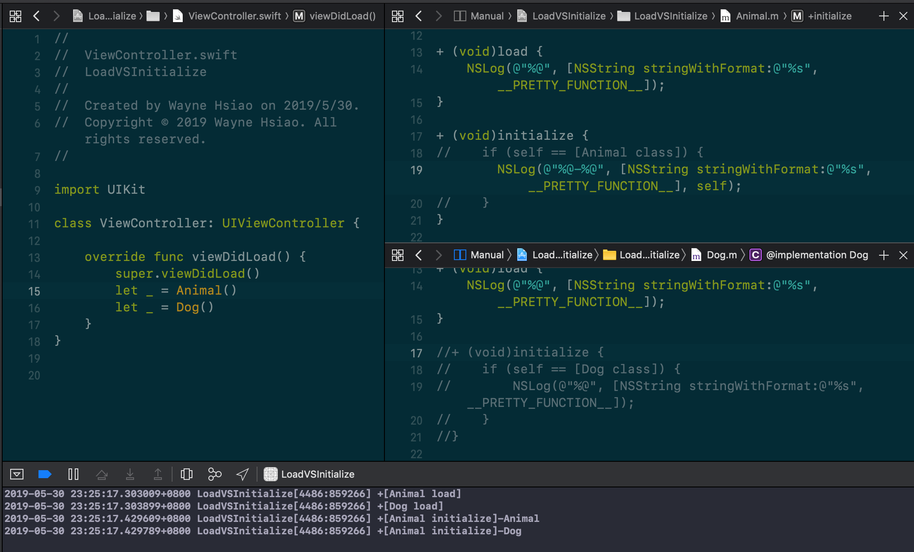

# +Load VS +Initialize

## +load
[+load](https://developer.apple.com/documentation/objectivec/nsobject/1418815-load)
`+load` is invoked as the class or category is added to the Objective-C runtime. It is suit to make a class setup for instance `Swizzle methods`. There are some features about `+load`.
1. Will be invoked even you didn't called the class.  
  
2. Be invoked before `main` function.

3. `+load` implemented in category will be invoked after the class's own `+load` called.

## +initialize
[initialize](https://developer.apple.com/documentation/objectivec/nsobject/1418639-initialize)
`+initialize` is invoked just before the class or any class that inherited from it, is sent its first message.
Since `+initialize` is called in a blocking manner, we should avoid complexity operation in there.  
There are some feature about `+initialize`.
1. Wouldn't be called if you didn't sent any message to the class.  
  
2. Will always sent to all class's superclasses before it's sent to the class itself. 
  
3. initialize be called once per class.
  
4. If subclass not implemented `+initialize`, then the superclasses wich implemented that will be called. In order to avoid improperly called, the canonical way to implement is add `if (self == [SomeClass self])` in the top of the implementation.
  

Author: Wayne Hsiao, chronicqazxc@gmail.com

